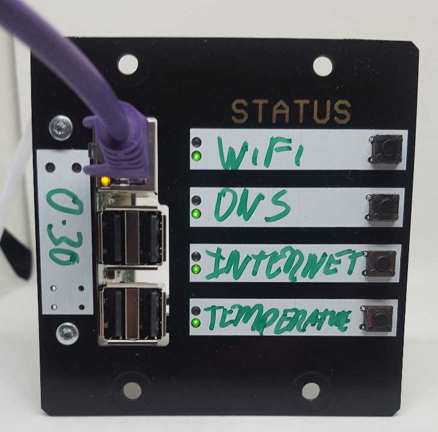
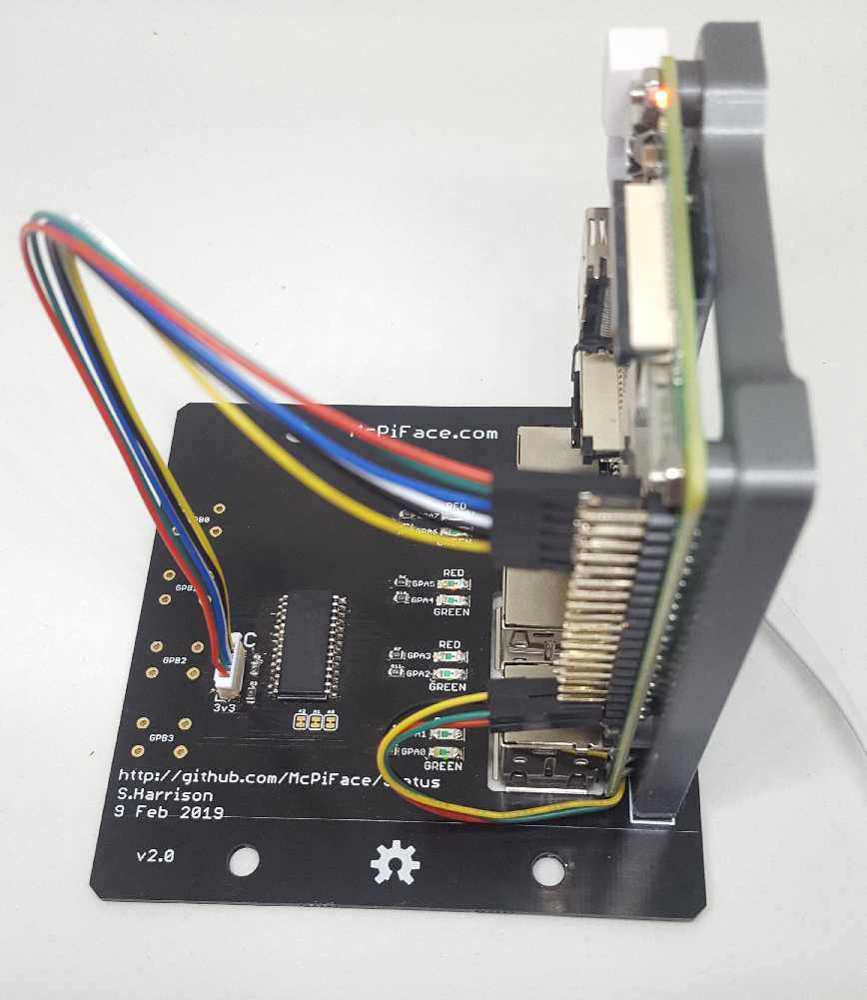
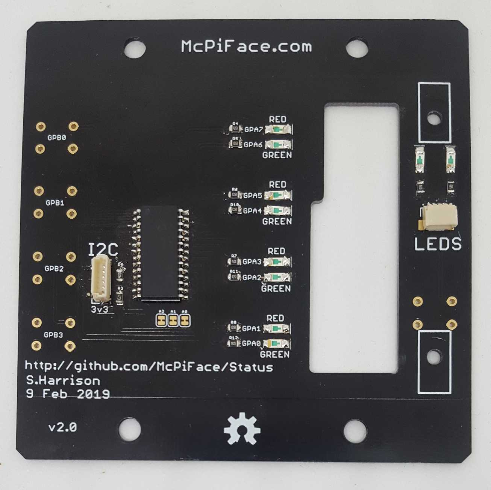

# McPiFace Status Board - Version 2

Rack Mountable Raspberry Pi Status Board.

Features 4x status indicators with red/green LEDs and optional buttons.

A status board in the McPiFace series, intended to fit the 19" rack frame as a quick status indicator.

This version uses the MCP23017 with The Pi's I2C. 

The connection uses the McPi I2C 6 Pin JST SH connection (1:1 connection with the first 6 pins of the Raspberry Pi second row of pins on the 40 pin header).

![Schematic] (Images/Schematic.png)

## Examples

See the examples folder for examples of use.

## Sled

To mount the raspberry Pi a 3D printable sled is available:

https://www.thingiverse.com/thing:3488157

## Rack Mount Frame

DAP Audio 2 HE Rackblende f. Modulsystem 10 Segmente MP-1 from Music Store.

* UK: https://www.dv247.com/en_GB/GBP/DAP-Audio-2-HE-Rackblende-f-Modulsystem-10-Segmente-MP-1/art-PAH0017160-000

* Germany: https://www.musicstore.de/en_US/USD/DAP-Audio-2-HE-Rackblende-f-Modulsystem-10-Segmente-MP-1/art-PAH0017160-000
